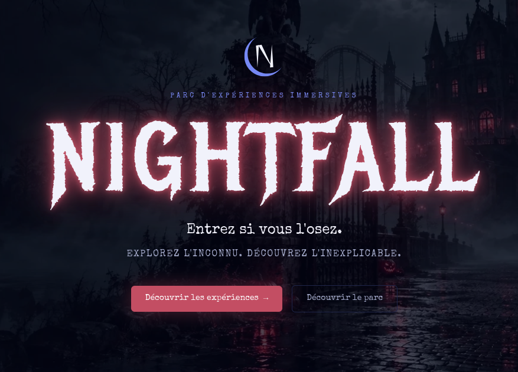
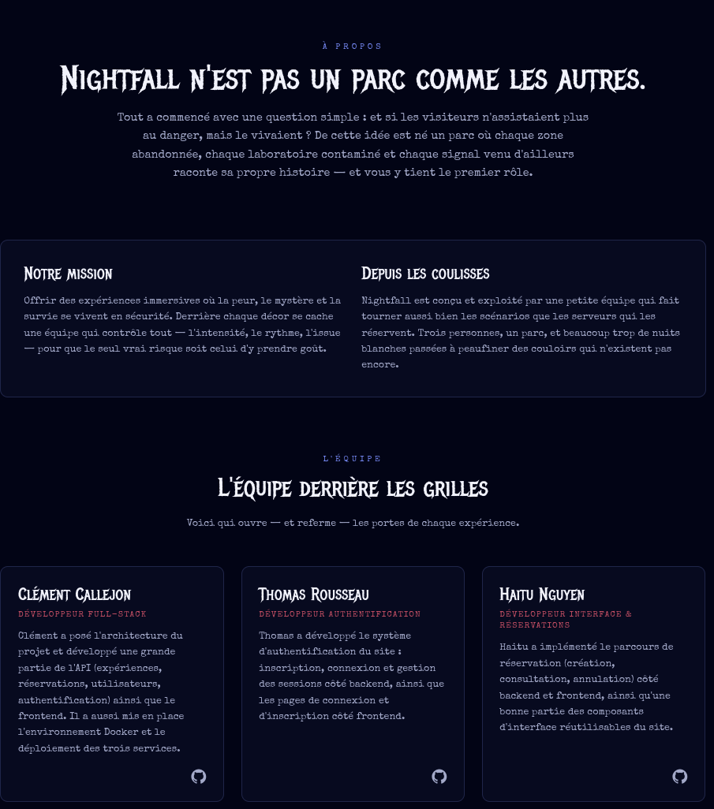
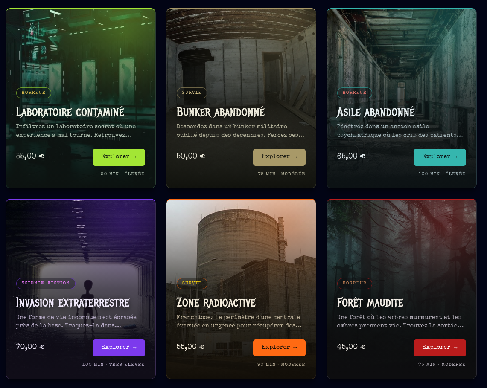
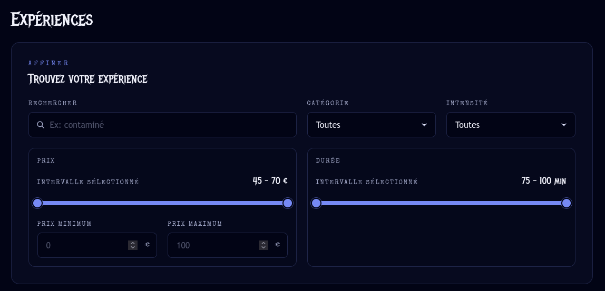
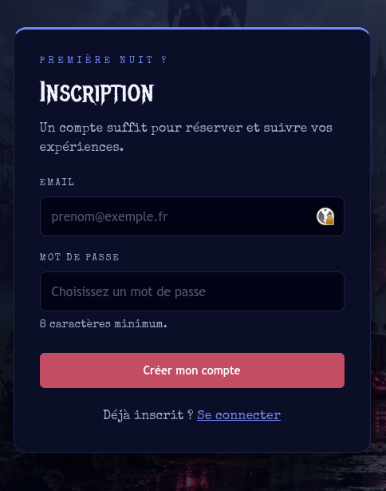
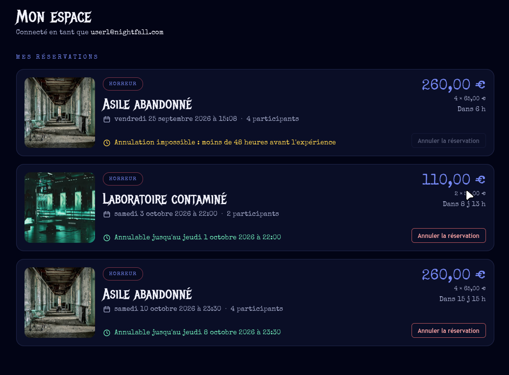
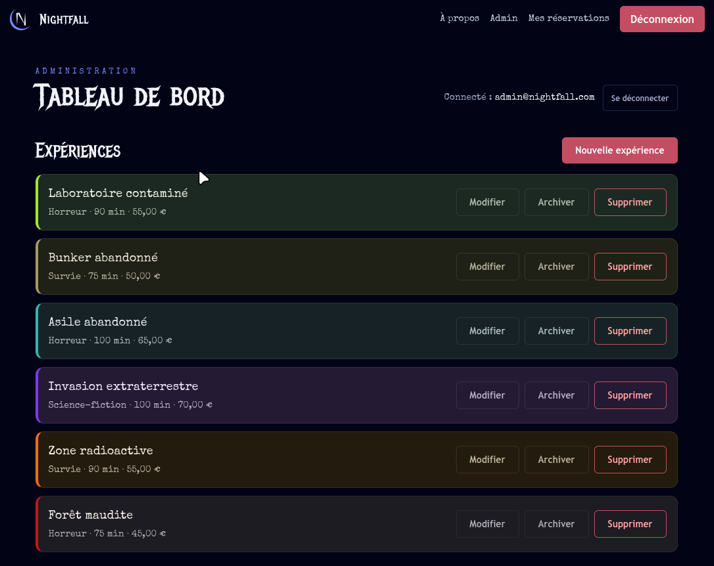

# Projet Nightfall

## Présentation
**Nightfall** est un parc à thème fictif immersif proposant des expériences de survie, de science-fiction et de catastrophe. Les visiteurs ne se contentent pas de monter dans des attractions : ils y participent. Des laboratoires contaminés aux invasions extraterrestres, chaque activité possède son propre univers, son niveau de difficulté et ses caractéristiques.

Cette application web permet aux visiteurs de :
- Découvrir et parcourir les expériences
- Rechercher et filtrer des activités
- Créer un compte et se connecter
- Réserver des billets
- Consulter et annuler leurs réservations
- Permettre aux administrateurs du parc de gérer le contenu (expériences, utilisateurs, réservations)

## Aperçu

### Page d'accueil


### Page à propos


### Liste des expériences


### Filtres de recherche


### Inscription


### Espace membre


### Espace administrateur


## Membres de l'équipe
- Haitu
- Clement
- Thomas

## Fonctionnalités réalisées

### Catalogue d'expériences
- Liste de toutes les expériences actives (`GET /api/experiences`)
- Détail d'une expérience (`GET /api/experiences/:id`)
- Recherche et filtres combinables (`GET /api/experiences/search`) : texte libre (nom/description), catégorie, durée maximale, niveau d'intensité maximal, nombre de participants minimum, prix minimum/maximum

### Authentification
- Inscription (`POST /api/auth/register`)
- Connexion (`POST /api/auth/login`), avec session stockée côté serveur et jeton JWT (Bearer) renvoyé au client
- Déconnexion (`POST /api/auth/logout`), qui invalide la session côté serveur

### Espace membre
- Réserver une expérience (`POST /api/reservations`), avec validation côté backend :
  - existence de l'expérience
  - date/heure future
  - nombre de participants valide et compatible avec la capacité maximale de l'expérience
- Consulter ses propres réservations (`GET /api/reservations`)
- Annuler une réservation (`DELETE /api/reservations/:id`), uniquement plus de 48 heures avant l'horaire prévu et uniquement par son propriétaire

### Espace administrateur
Réservé aux comptes avec `is_admin = true` :
- Créer, modifier, archiver/désarchiver et supprimer des expériences (`POST` / `PUT` / `PATCH /:id/toggle-archive` / `DELETE` sur `/api/experiences`)
- Voir les expériences archivées dans le catalogue
- Créer et supprimer des comptes utilisateurs (`POST` / `DELETE` sur `/api/users`)
- Consulter tous les utilisateurs avec leurs réservations (`GET /api/users`)
- Tableau de bord d'administration côté frontend (gestion des expériences, des utilisateurs et des réservations)

### Documentation de l'API
La documentation interactive (Swagger/OpenAPI) est servie par le backend à l'adresse `http://localhost:5080/api-docs` une fois les services démarrés.

## Technologies utilisées

### Frontend
- **React 18** + **React Router**
- **Vite** (serveur de développement et build)
- **Tailwind CSS**

### Backend
- **Node.js** avec **Express** (API REST)
- **MySQL** via `mysql2` pour l'accès à la base de données
- **JWT** (`jsonwebtoken`) pour les jetons de session et **bcryptjs** pour le hachage des mots de passe
- **Swagger UI** (`swagger-ui-express`) pour la documentation de l'API
- **Jest** et **Supertest** pour les tests

### Base de données
- **MySQL 8**, schéma initialisé via `src/database/init.sql`

### DevOps
- **Docker** et **Docker Compose** pour la conteneurisation et l'orchestration des trois services (frontend, backend, base de données)
- **Git** et **GitHub** pour le contrôle de version

## Prérequis
- Docker et Docker Compose (suffisant pour lancer l'intégralité du projet)
- Git

Pour un développement en local sans Docker, en plus des prérequis ci-dessus :
- Node.js (v18 ou supérieur)
- npm
- Une instance MySQL accessible

## Procédure de lancement complète avec Docker Compose

### 1. Cloner le dépôt
```bash
git clone git@github.com:ClaymeCall/holbertonschool-nightfall.git
cd holbertonschool-nightfall
```

### 2. Configurer les variables d'environnement
Créez un fichier `.env` dans chacun des trois sous-dossiers (`src/backend`, `src/frontend`, `src/database`) en copiant le fichier `.env.example` correspondant.

```bash
cp src/backend/.env.example src/backend/.env
cp src/frontend/.env.example src/frontend/.env
cp src/database/.env.example src/database/.env
```

#### Backend (`src/backend/.env`)
```env
DB_HOST=database
DB_PORT=3306
DB_NAME=nightfall
DB_USER=nightfall
DB_PASSWORD=nightfall
PORT=5080
JWT_SECRET=your_jwt_secret_here
```

#### Frontend (`src/frontend/.env`)
```env
VITE_API_URL=http://localhost:5080/api
```

#### Database (`src/database/.env`)
```env
MYSQL_DATABASE=nightfall
MYSQL_USER=nightfall
MYSQL_PASSWORD=nightfall
MYSQL_ROOT_PASSWORD=root_password
DB_PORT=3306
```

### 3. Construire et démarrer les services
Depuis la racine du dépôt :
```bash
docker compose up --build
```

Ceci démarre trois conteneurs :
- `database` : MySQL, avec un contrôle de santé (`healthcheck`) qui attend que le serveur MySQL réponde
- `backend` : attend que la base de données soit prête (`service_healthy`), **peuple automatiquement la base avec un jeu de données de démonstration** (comptes utilisateurs, expériences, réservations — voir `src/backend/src/utils/seed.js`), puis démarre l'API en mode développement
- `frontend` : démarre le serveur de développement Vite

Le seed est idempotent : il réinitialise puis réinsère les données à chaque démarrage du conteneur backend, donc un `docker compose up` répété ne crée jamais de doublons.

### 4. Accéder à l'application
Une fois les services démarrés :
- Frontend : http://localhost:5173
- Backend (API) : http://localhost:5080/api
- Documentation de l'API (Swagger) : http://localhost:5080/api-docs

Les ports exposés peuvent être personnalisés via les variables d'environnement `FRONTEND_PORT`, `BACKEND_PORT` et `DB_PORT` (voir `docker-compose.yml`).

### Arrêter les services
```bash
docker compose down
```

## Comptes de démonstration
Ces comptes sont créés automatiquement au démarrage du backend (voir `src/backend/src/utils/seed.js`) :

| Rôle          | Email                  | Mot de passe |
|---------------|-------------------------|--------------|
| Administrateur | `admin@nightfall.com`  | `admin123`   |
| Membre         | `user1@nightfall.com`  | `password123`|
| Membre         | `user2@nightfall.com`  | `password123`|

Un visiteur non connecté peut parcourir et rechercher les expériences sans identifiants.
