# NIGHTFALL — Documentation Mermaid

> Documentation basée sur la branche `main` au commit `f10c7b8`.
> Les diagrammes correspondent au code et au schéma SQL actuellement présents dans le dépôt.

## 1. Architecture générale

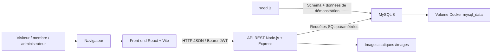

### Services Docker Compose

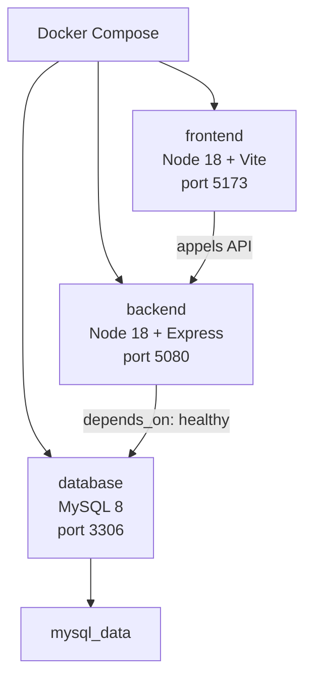

## 2. Structure applicative

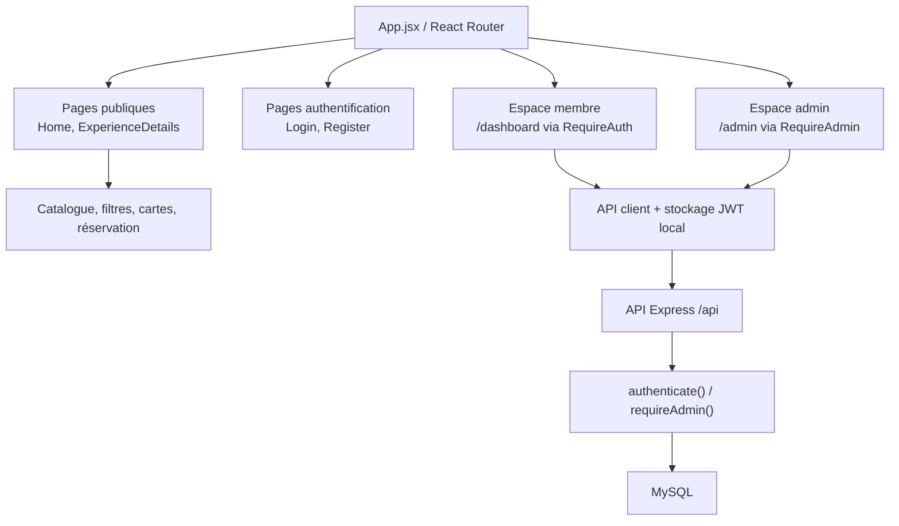

## 3. Modèle de données réel

> La table `categories` n’existe pas dans `src/database/init.sql` : la catégorie est stockée directement dans `experiences.category`.

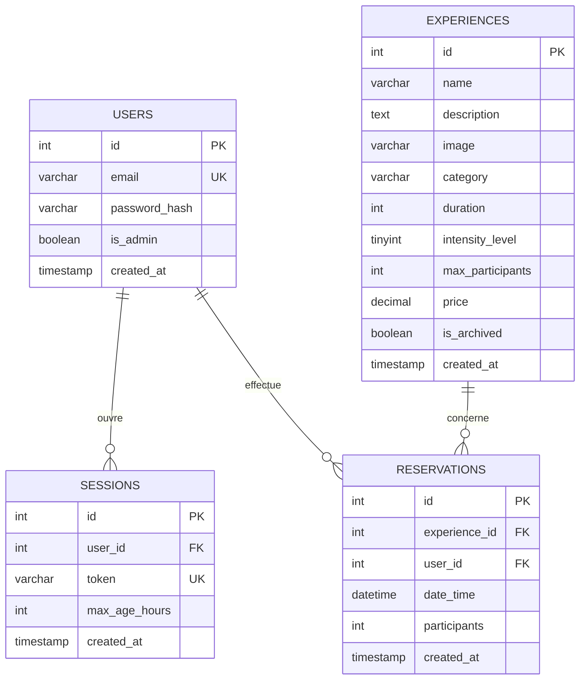

### Contraintes métier principales

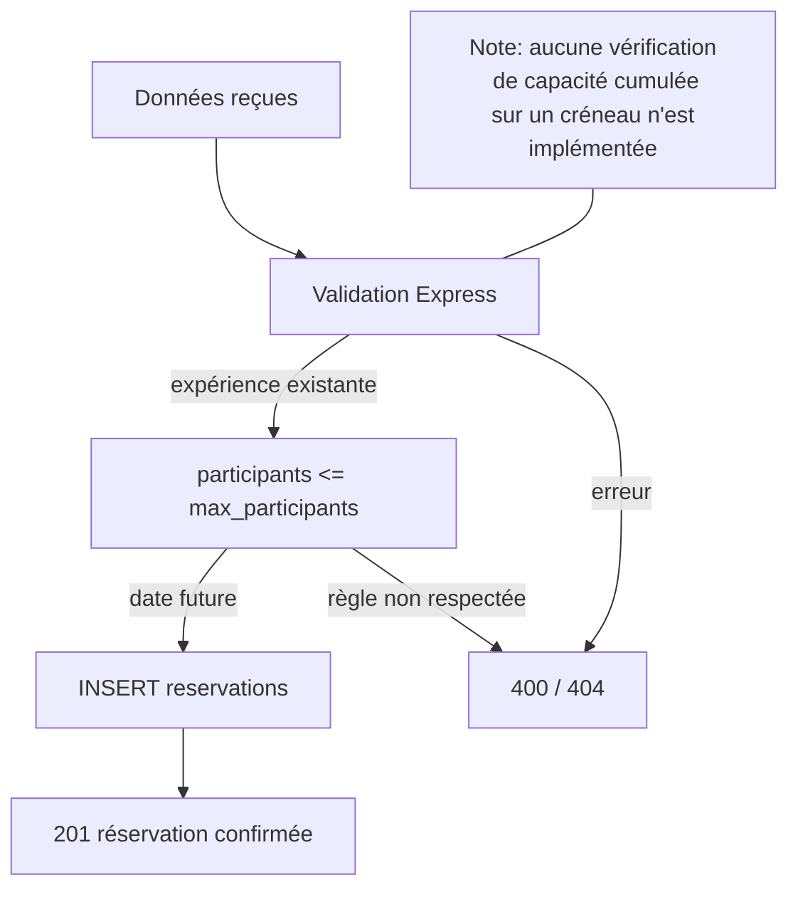

## 4. Parcours de réservation

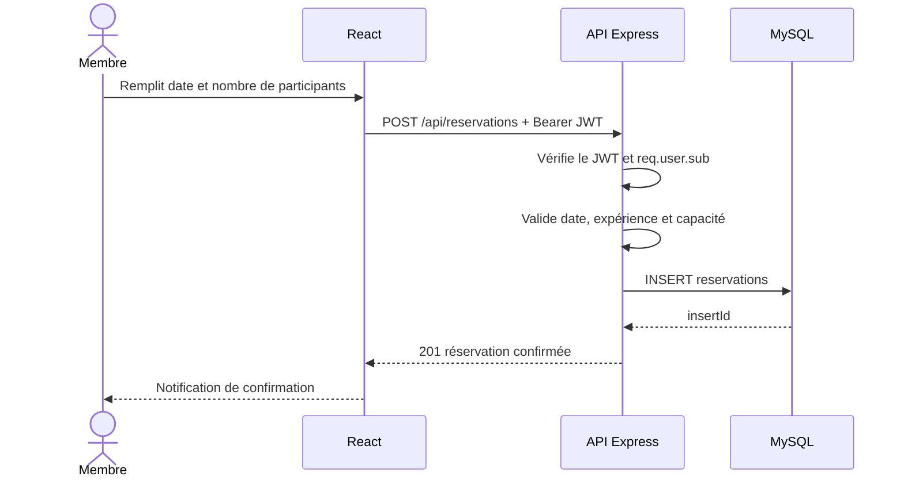

## 5. Consultation et annulation

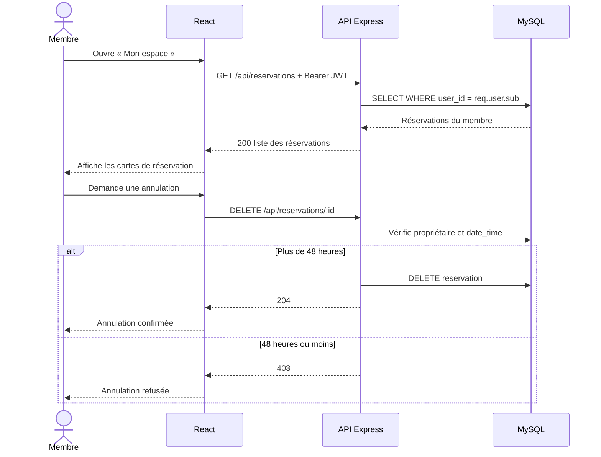

## 6. Authentification et autorisations

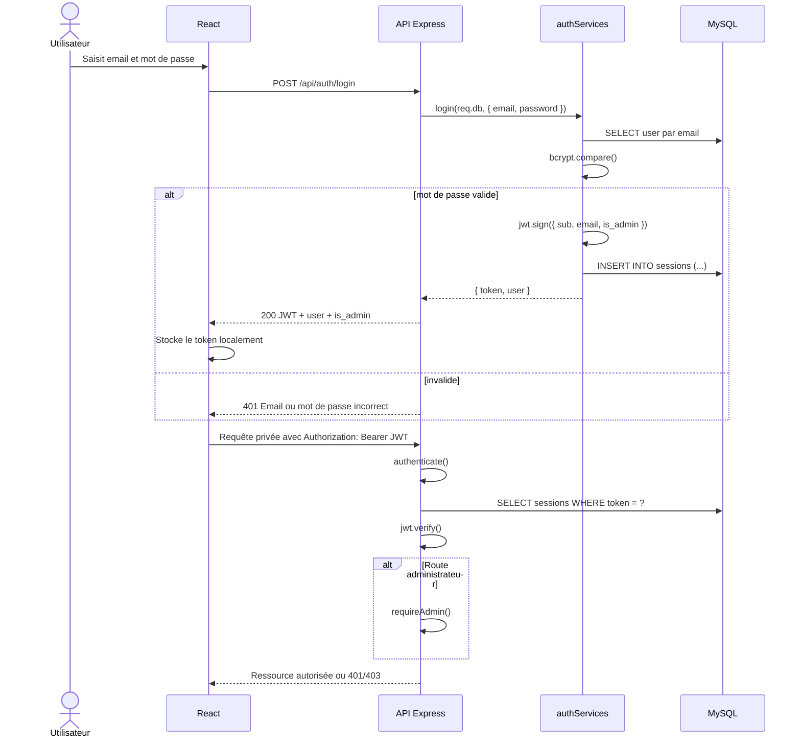

## 7. Catalogue et filtres

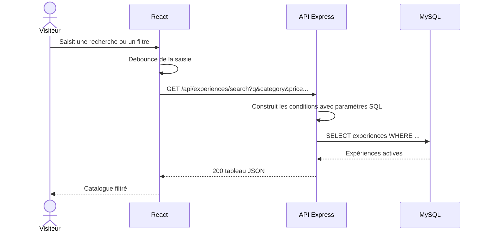

## 8. Administration du catalogue

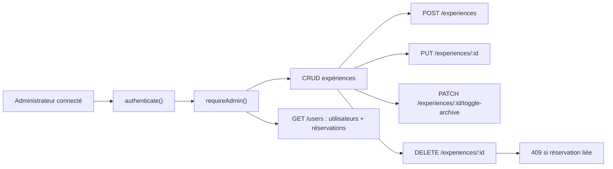

## 9. Routes API essentielles

| Méthode | Route | Accès | Rôle |
|---|---|---|---|
| `GET` | `/api/experiences` | Public | Liste les expériences non archivées (sauf admin qui voit aussi les archivées) |
| `GET` | `/api/experiences/search` | Public | Recherche et filtres combinables |
| `GET` | `/api/experiences/:id` | Public | Détail d’une expérience, 404 si archivée et non admin |
| `POST` | `/api/auth/register` | Public | Crée un compte membre |
| `POST` | `/api/auth/login` | Public | Retourne un JWT et l’utilisateur |
| `POST` | `/api/auth/logout` | Authentifié | Supprime la session |
| `GET` | `/api/auth/me` | Authentifié | Non implémenté — `501 Not implemented` |
| `POST` | `/api/reservations` | Authentifié | Crée une réservation |
| `GET` | `/api/reservations` | Authentifié | Liste les réservations du membre |
| `DELETE` | `/api/reservations/:id` | Propriétaire | Annule si délai supérieur à 48 h |
| `POST` | `/api/experiences` | Admin | Ajoute une expérience |
| `PUT` | `/api/experiences/:id` | Admin | Modifie une expérience |
| `PATCH` | `/api/experiences/:id/toggle-archive` | Admin | Archive/désarchive |
| `DELETE` | `/api/experiences/:id` | Admin | Supprime si aucune réservation liée |
| `GET` | `/api/users` | Admin | Consulte les utilisateurs et réservations |
| `GET` | `/api/users/:id` | Admin | Non implémenté — `501 Not implemented` |
| `PUT` | `/api/users/:id` | Admin | Non implémenté — `501 Not implemented` |

## 10. Initialisation des données de démonstration

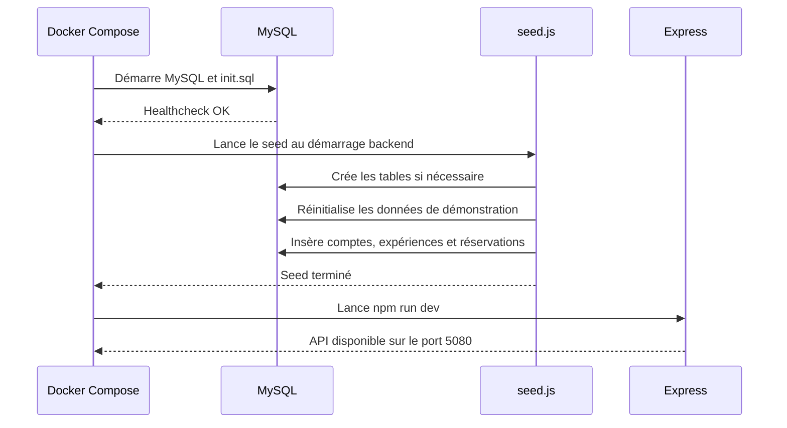

> **Attention :** le seed actuel supprime puis recrée les données. Un redémarrage du backend peut donc effacer les réservations créées pendant une démonstration.

## 11. Comptes de démonstration

| Rôle | Email | Mot de passe |
|---|---|---|
| Membre | `user1@nightfall.com` | `password123` |
| Membre | `user2@nightfall.com` | `password123` |
| Administrateur | `admin@nightfall.com` | `admin123` |

## 12. Limites connues à mentionner

- `GET /api/auth/me` retourne encore `501 Not implemented`.
- `GET /api/users/:id` et `PUT /api/users/:id` sont également non implémentées.
- La capacité cumulée de toutes les réservations sur un même créneau n’est pas calculée, donc le système n’empêche pas l’overbooking sur un même horaire.
- Le schéma SQL stocke la catégorie en texte ; il n’existe pas de table `categories`.
- Le README du dépôt contient encore plusieurs informations à actualiser concernant les ports, variables Vite, comptes de démonstration et routes.
- Le calcul de l’annulation est basé sur `hoursUntilReservation <= 48`, mais il dépend d’une conversion de date entre MySQL et JavaScript, donc une validation plus robuste serait recommandée pour éviter les écarts de fuseau / type.

## 13. Sources du dépôt

- [Branche main](https://github.com/ClaymeCall/holbertonschool-nightfall/tree/main)
- [Docker Compose](https://github.com/ClaymeCall/holbertonschool-nightfall/blob/main/docker-compose.yml)
- [Schéma SQL](https://github.com/ClaymeCall/holbertonschool-nightfall/blob/main/src/database/init.sql)
- [Routes expériences](https://github.com/ClaymeCall/holbertonschool-nightfall/blob/main/src/backend/src/routes/experiences.js)
- [Routes réservations](https://github.com/ClaymeCall/holbertonschool-nightfall/blob/main/src/backend/src/routes/reservations.js)
- [Middleware authentification](https://github.com/ClaymeCall/holbertonschool-nightfall/blob/main/src/backend/src/middleware/auth.js)
- [Script de seed](https://github.com/ClaymeCall/holbertonschool-nightfall/blob/main/src/backend/src/utils/seed.js)
