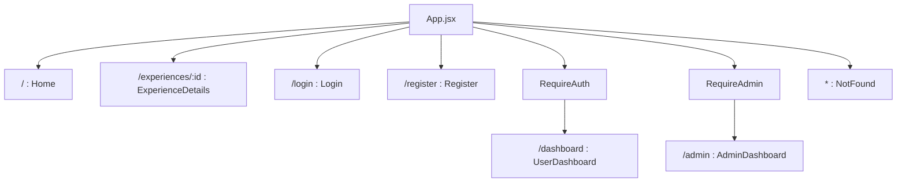
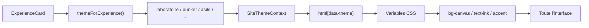
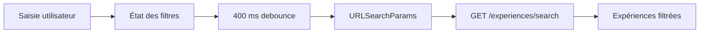
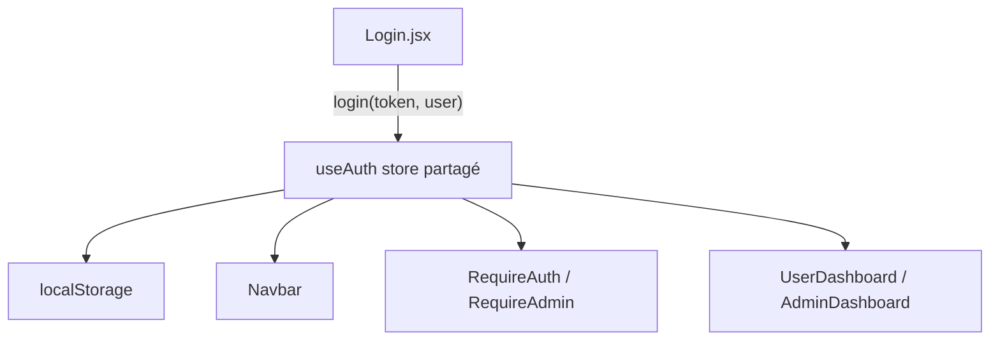

# NIGHTFALL — Documentation du front-end

Documentation du front-end NIGHTFALL basée sur la branche `main` et son état actuel.

## 1. Rôle du front-end

Le front-end est une application React qui permet de :

- présenter le parc et ses expériences ;
- rechercher et filtrer le catalogue ;
- consulter le détail d’une expérience ;
- créer un compte et se connecter ;
- réserver une expérience ;
- consulter et annuler ses réservations ;
- accéder à l’espace administrateur selon le rôle de l’utilisateur.

Le front-end ne doit pas porter les règles de sécurité principales. Il affiche les informations et facilite les interactions, mais c’est l’API Express qui valide réellement les données, le JWT, le rôle administrateur et la règle des 48 heures.

## 2. Technologies utilisées

| Technologie | Utilisation |
|---|---|
| React | Composants et rendu de l’interface |
| React Router | Navigation entre les pages |
| Vite | Serveur de développement et build |
| Tailwind CSS | Classes utilitaires et responsive design |
| DaisyUI | Quelques composants et classes d’interface |
| JavaScript / JSX | Code applicatif |
| Fetch API | Communication avec le backend |
| localStorage | Conservation locale du JWT et des informations utilisateur |

## 3. Lancer le front-end

### Avec Docker Compose

À la racine du projet :

```bash
docker compose up --build
```

Le front est exposé par défaut sur :

```text
http://localhost:5173
```

### En développement local

```bash
cd src/frontend
npm install
npm run dev
```

Le fichier `src/frontend/.env` doit contenir :

```env
VITE_API_URL=http://localhost:5080/api
```

Important : Vite utilise le préfixe `VITE_`. Une variable appelée `REACT_APP_API_URL` ne sera pas lue par cette configuration.

## 4. Organisation des fichiers

```text
src/frontend/
├── public/
│   └── assets/              # Images utilisées directement par le front
├── src/
│   ├── components/
│   │   ├── admin/            # Panneaux de l’espace administrateur
│   │   ├── common/           # Navbar, Layout, protections de routes
│   │   ├── feature/          # Catalogue, filtres, réservation
│   │   └── ui/               # Boutons, alertes, badges, icônes, skeletons
│   ├── context/
│   │   └── SiteThemeContext.jsx
│   ├── hooks/
│   │   ├── useApiResource.js
│   │   ├── useAuth.js
│   │   ├── useDebouncedValue.js
│   │   └── useExperienceFilters.js
│   ├── lib/
│   │   ├── api.js            # Client HTTP commun
│   │   ├── cancellation.js   # Règle des 48 heures côté affichage
│   │   ├── format.js         # Prix, dates et images
│   │   ├── intensity.js      # Conversion des niveaux d’intensité
│   │   └── themes.js         # Ambiance selon l’expérience
│   ├── pages/
│   │   ├── Home.jsx
│   │   ├── ExperienceDetails.jsx
│   │   ├── Login.jsx
│   │   ├── Register.jsx
│   │   ├── UserDashboard.jsx
│   │   └── AdminDashboard.jsx
│   ├── App.jsx               # Routes principales
│   └── index.css             # Variables CSS et styles globaux
└── tailwind.config.js
```

## 5. Navigation React

Les routes sont centralisées dans `src/App.jsx`.



`RequireAuth` redirige vers `/login` si aucun token n’est présent. `RequireAdmin` vérifie également `user.is_admin` et affiche un refus d’accès pour un membre classique.

## 6. Communication avec l’API

Tous les appels doivent passer par `src/lib/api.js` plutôt que d’utiliser directement `fetch` dans chaque composant.

```js
import { apiRequest } from '../lib/api';

const experiences = await apiRequest('/experiences');

const reservation = await apiRequest('/reservations', {
  method: 'POST',
  token,
  body: JSON.stringify({
    experience_id: experience.id,
    date: new Date(dateTime).toISOString(),
    participants: 2,
  }),
});
```

Le client :

1. préfixe automatiquement le chemin avec `VITE_API_URL` ;
2. ajoute `Content-Type: application/json` ;
3. ajoute `Authorization: Bearer <token>` lorsqu’un token est fourni ;
4. convertit la réponse JSON ;
5. transforme les réponses HTTP d’erreur en `Error` avec `error.status`.

`useApiResource` utilise ce client pour gérer automatiquement `data`, `loading`, `error` et `refetch`.

## 7. Fonctionnalité importante : changement d’ambiance et de couleurs

### Objectif

Lorsqu’un visiteur survole ou sélectionne une carte d’expérience, le site adapte son ambiance visuelle. La couleur ne vient pas de la base de données : elle est calculée côté front à partir de l’image ou de la catégorie de l’expérience.

### Étape 1 — Associer une expérience à une ambiance

Le fichier `src/lib/themes.js` contient deux associations :

```js
const THEME_BY_IMAGE = {
  'laboratoire-contamine.jpg': 'laboratoire',
  'invasion-extraterrestre.jpg': 'paranormal',
  'bunker-abandonne.jpg': 'bunker',
  'asile-abandonne.jpg': 'asile',
  'zone-radioactive.jpg': 'radioactif',
};

const THEME_BY_CATEGORY = {
  horreur: 'horreur',
  survie: 'bunker',
  'science-fiction': 'laboratoire',
  action: 'radioactif',
  'escape game': 'paranormal',
};
```

La fonction donne la priorité à l’image, car elle est plus précise. Si aucune image ne correspond, la catégorie est utilisée. Si aucune correspondance n’est trouvée, le thème par défaut est conservé.

```js
export function themeForExperience({ image, category } = {}) {
  return THEME_BY_IMAGE[image]
    ?? THEME_BY_CATEGORY[category?.trim().toLowerCase()];
}
```

### Étape 2 — Stocker le thème dans un contexte React

`SiteThemeContext.jsx` expose la fonction `setSiteTheme` à tous les composants :

```jsx
const setSiteTheme = useSiteTheme();
setSiteTheme('radioactif');
```

Le provider ajoute ensuite l’attribut sur l’élément HTML principal :

```html
<html data-theme="radioactif">
```

Le thème est global. Il peut donc modifier le fond, la navbar, le logo et les autres composants qui utilisent les variables CSS.

### Étape 3 — Définir les variables CSS

Les couleurs sont définies dans `src/index.css` avec des variables RGB :

```css
:root {
  --color-canvas: 2 4 21;
  --color-surface: 10 14 38;
  --color-accent: 195 78 99;
  --color-highlight: 118 137 245;
}

[data-theme='radioactif'] {
  --color-canvas: 18 14 8;
  --color-surface: 36 27 15;
  --color-accent: 255 106 19;
  --color-highlight: 255 214 10;
}
```

Les classes Tailwind utilisent ensuite ces variables :

```jsx
<div className="bg-canvas text-ink border-accent">
  Contenu thématisé
</div>
```

La configuration Tailwind transforme `bg-canvas`, `text-ink`, `bg-accent/60`, etc. en couleurs basées sur les variables CSS.

### Étape 4 — Activer le thème sur une carte

Dans `ExperienceCard.jsx`, le thème est activé pendant le survol ou le focus clavier :

```jsx
const theme = themeForExperience(experience);
const setSiteTheme = useSiteTheme();
const [isActive, setIsActive] = useState(false);

useEffect(() => {
  if (!theme || !isActive) return undefined;

  setSiteTheme(theme);
  return () => setSiteTheme(null);
}, [theme, isActive, setSiteTheme]);
```

Le nettoyage est essentiel. Sans `setSiteTheme(null)`, l’ambiance précédente resterait active après le départ de la souris ou le démontage du composant.

La carte écoute à la fois la souris et le clavier :

```jsx
onMouseEnter={() => setIsActive(true)}
onMouseLeave={() => setIsActive(false)}
onFocus={() => setIsActive(true)}
onBlur={() => setIsActive(false)}
```

### Étape 5 — Appliquer le thème sur une fiche détail

La page `ExperienceDetails.jsx` applique également le thème pendant toute la durée de vie de la page. Cela évite que la navbar reste avec l’ambiance par défaut lorsque l’utilisateur consulte directement une expérience.

```jsx
useEffect(() => {
  if (!theme) return undefined;

  setSiteTheme(theme);
  return () => setSiteTheme(null);
}, [theme, setSiteTheme]);
```

### Schéma du changement de couleur



### Ajouter une nouvelle ambiance

Pour ajouter une nouvelle ambiance :

1. ajouter une association dans `THEME_BY_IMAGE` ou `THEME_BY_CATEGORY` ;
2. créer un bloc `[data-theme='nouveau-theme']` dans `src/index.css` ;
3. définir au minimum `--color-canvas`, `--color-surface`, `--color-line`, `--color-ink`, `--color-ink-muted`, `--color-accent`, `--color-accent-fg` et `--color-highlight` ;
4. vérifier le contraste du texte ;
5. tester le survol, le focus clavier et l’ouverture directe de la fiche.

Ne pas ajouter un thème dans `themes.js` sans ajouter ses variables CSS : le site utiliserait alors le thème par défaut pour les couleurs manquantes.

## 8. Filtres du catalogue

Les filtres sont répartis entre :

- `ExperienceFilters.jsx` : affichage des champs ;
- `useExperienceFilters.js` : état et construction de la requête ;
- `useDebouncedValue.js` : délai avant l’envoi ;
- `/api/experiences/search` : filtrage côté backend.

Les critères disponibles sont :

- recherche textuelle ;
- catégorie ;
- intensité maximale ;
- prix minimum et maximum ;
- durée minimum et maximum.

Le délai actuel est de 400 ms. Cela évite d’envoyer une requête à chaque caractère saisi ou à chaque déplacement d’un curseur.



Lorsque tous les filtres sont vides, le front utilise `GET /experiences`. Lorsqu’au moins un filtre est actif, il utilise `GET /experiences/search?...`.

## 9. Authentification côté front

`useAuth.js` est un store partagé entre les composants React grâce à `useSyncExternalStore`.

Les clés utilisées dans `localStorage` sont :

```text
token           JWT retourné par l’API
nightfall_user  { email, is_admin }
```

Le store permet à la navbar, aux pages et aux guards de voir immédiatement la même session.



Le front utilise `is_admin` pour l’expérience de navigation, mais l’API doit toujours refaire le contrôle avec `authenticate` et `requireAdmin`.

## 10. Réservation et annulation côté interface

`ReservationPanel.jsx` :

- affiche le prix par personne ;
- limite le nombre de participants avec la capacité de l’expérience ;
- exige une date future ;
- envoie la réservation à l’API ;
- affiche une notification de succès ou d’erreur.

`ReservationCard.jsx` :

- calcule l’état de la réservation avec `getCancellationInfo` ;
- affiche la date limite d’annulation ;
- demande une confirmation avant suppression ;
- désactive l’action lorsque le délai est dépassé ;
- laisse malgré tout l’API confirmer la règle côté serveur.

## 11. Conventions pour ajouter une fonctionnalité

Pour une nouvelle page :

1. créer le fichier dans `src/pages/` ;
2. ajouter la route dans `App.jsx` ;
3. utiliser `Layout` pour conserver la navigation commune ;
4. protéger la page avec `RequireAuth` ou `RequireAdmin` si nécessaire ;
5. gérer les états chargement, erreur et absence de données.

Pour un nouvel appel API :

1. utiliser `apiRequest` ;
2. transmettre le token avec l’option `token` si la route est privée ;
3. utiliser des chemins relatifs comme `/experiences` ;
4. afficher une erreur compréhensible à l’utilisateur ;
5. ne jamais coder l’URL backend directement dans un composant.

Pour un nouveau composant :

- `components/ui/` pour un composant générique ;
- `components/common/` pour la navigation et la structure ;
- `components/feature/` pour une fonctionnalité métier ;
- `components/admin/` pour l’administration.

## 12. Points de vigilance

- Le nom de variable frontend est `VITE_API_URL`.
- Une modification des noms de colonnes backend doit être répercutée dans les composants qui consomment les réponses JSON.
- Toute ambiance ajoutée doit avoir ses variables dans `index.css`.
- Toujours nettoyer le thème dans le retour du `useEffect`.
- Ne pas considérer le contrôle React comme une protection suffisante : les rôles sont validés côté API.
- Ne pas stocker de mot de passe dans le navigateur.
- Les images des expériences viennent de l’API via `API_ORIGIN/images/experiences/`.
- Le front affiche la règle des 48 heures, mais la décision finale appartient au backend.

## 13. Vérification avant une démonstration

```bash
cd src/frontend
npm run build
```

Checklist manuelle :

- [ ] l’accueil affiche le hero et les expériences ;
- [ ] les images se chargent ;
- [ ] le survol d’une carte change l’ambiance du site ;
- [ ] le focus clavier change également l’ambiance ;
- [ ] le thème revient à la normale après le départ de la carte ;
- [ ] la recherche attend avant d’envoyer la requête ;
- [ ] les filtres prix et durée ne produisent pas une plage inversée ;
- [ ] un membre peut se connecter et accéder à son espace ;
- [ ] un membre ne peut pas accéder à `/admin` ;
- [ ] un administrateur peut accéder au tableau de bord ;
- [ ] une réservation affiche une confirmation ;
- [ ] l’annulation reflète correctement la règle des 48 heures.

## 14. Références principales

- `src/frontend/src/App.jsx`
- `src/frontend/src/context/SiteThemeContext.jsx`
- `src/frontend/src/lib/themes.js`
- `src/frontend/src/index.css`
- `src/frontend/tailwind.config.js`
- `src/frontend/src/hooks/useExperienceFilters.js`
- `src/frontend/src/hooks/useAuth.js`
- `src/frontend/src/lib/api.js`
- `src/frontend/src/components/common/ExperienceCard.jsx`
- `src/frontend/src/pages/ExperienceDetails.jsx`
